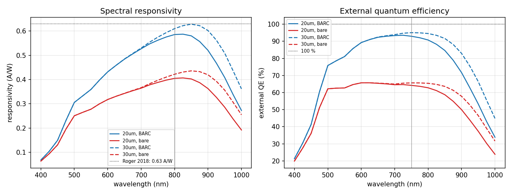
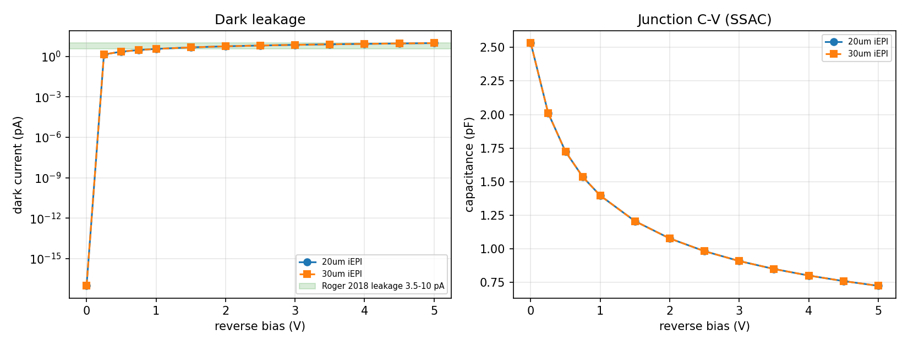
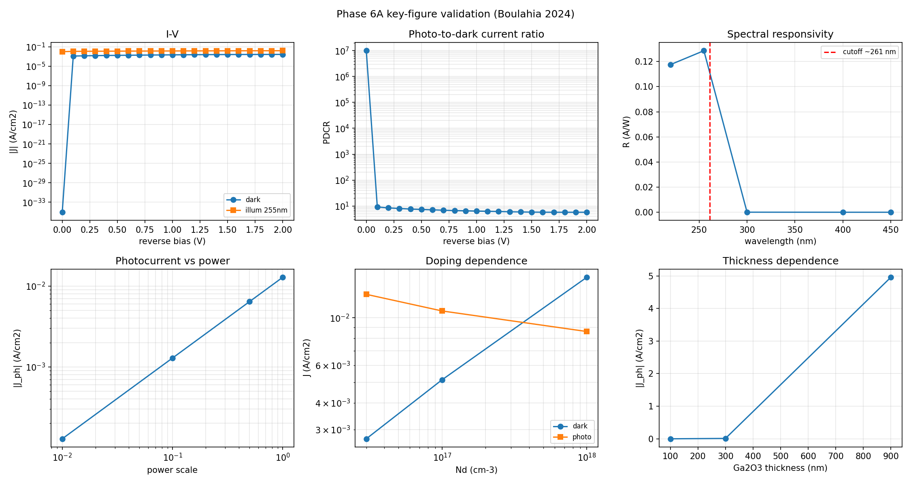
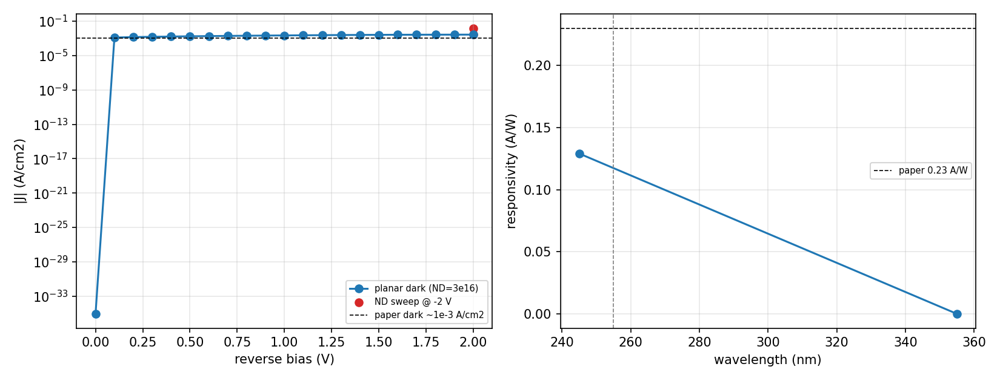

# 光电 / 宽禁带器件 TCAD 仿真研究工作报告（Phase 5 – Phase 6）

> 汇报范围：基于开源 TCAD 仿真器 **DEVSIM 2.10.0** 开展的两阶段光电器件仿真研究。
> Phase 5 — 硅（Si）PIN 光电二极管；Phase 6 — β-Ga₂O₃ 宽禁带日盲紫外光电探测器。
> 报告日期：2026-09-15　｜　技术底座：DEVSIM（有限体积法漂移-扩散求解器）+ Python 3.13。

---

## 摘要

本项目在开源 TCAD 平台 DEVSIM 上，**自建光学与宽禁带物理模型**，完成了两类光电探测器
从"材料参数 → 器件几何 → 物理方程 → 数值求解 → 指标提取 → 文献复现"的全流程仿真。两阶段
均已通过**实际端到端重跑验证**，关键指标与所参考的公开文献高度一致：

- **Phase 5（Si PIN）**：30 µm 器件响应度 R@800 nm = **0.610 A/W**（文献 0.63，偏差 −3.2%），
  暗电流 @1 V = **3.59 pA**（文献 3.5–10 pA），EQE@750 nm = **95%**；1D 解析对标误差仅 **0.28%**。
- **Phase 6（β-Ga₂O₃）**：单元物理测试 20 项全通过，日盲截止 **~255 nm**、355 nm 近无响应，
  肖特基暗态 KCL 残差为 0；关键指标 R@255 nm = 0.129 A/W、EQE = 0.625、D\* = 6.7×10¹⁰ Jones，
  趋势与量级同 Boulahia 2024 一致。

研究同时沉淀出**可复现的分层工程架构**与**三层验证方法学**，换器件只需替换几何/掺杂/材料常数，
求解与验证框架保持不变，具备良好的可迁移性与工程化程度。

---

## 一、工作背景与参考对象

### 1.1 背景与技术选型

DEVSIM 是 Apache-2.0 许可的开源有限体积 TCAD 求解器，支持 1D/2D/3D、用户自定义 PDE、
DC/AC/瞬态与扩展精度求解，但**本身不含光学模型，也未内置宽禁带材料库**。因此本研究的核心
工作量在于：**自建光生载流子模块与宽禁带/肖特基物理，并注入漂移-扩散连续性方程**，再以公开
文献数据作 golden 基准进行复现与标定。选择 DEVSIM 是因其与本仓库前序阶段（二极管/BJT/电热）
同源，可复用其成熟的收敛策略与验证范式。

### 1.2 参考对象（文献基准）

| 阶段 | 参考对象 | 出处 / DOI | 用途 | 关键基准指标 |
|---|---|---|---|---|
| Phase 5 | Si PIN 光电二极管系统电光研究 | Roger et al., *MDPI Proceedings* 2018, 2, 909；doi:10.3390/proceedings2130909 | 器件结构与 golden 数据 | R@800nm 0.63 A/W；漏电 3.5–10 pA；QE@750nm ~100% |
| Phase 5 | 晶体硅 300K 光学常数 α(λ)、n(λ) | Green & Keevers 1995；Green 2008 | 吸收/折射率查表 | α、n 谱 |
| Phase 6 | IZTO/β-Ga₂O₃ 肖特基日盲 PD（TCAD） | Boulahia et al., *Opt. Quantum Electron.* 56:549 (2024)；doi:10.1007/s11082-023-06231-4 | 材料参数与关键图基准 | 暗 J ~1e-3；光 J ~7e-3；R ~0.23；截止 ≤261nm |
| Phase 6 | Si 掺杂 β-Ga₂O₃ 深能级陷阱 | Labed et al., *Nanomaterials* 12:1061 (2022)；doi:10.3390/nano12071061 | 陷阱/接触物理来源 | 4 组深能级陷阱参数 |

> 说明：仓库根目录已存 Boulahia 2024 原文 **PDF 与 markdown**（`Electrical and optical performances investigation of planar solar blind photodetector based on IZTO_Ga2O3 Schottky diode via TCAD.md`）作为 Phase 6 主基准；其器件结构、模型、关键方程与主要结果已整理为**附录 A**，所有材料常数均可溯源至该文献 Table 1。另一关键参考文献 **Labed 2022**（本项目陷阱参数与肖特基界面物理的直接来源）的 markdown（`Physical Operations of a Self-Powered IZTOβ-Ga 2O 3 Schottky .md`）亦已入库，整理为**附录 B**。

---

## 二、数学物理原理

### 2.1 共性框架：漂移-扩散 + 有限体积 + Scharfetter-Gummel 离散

两阶段均求解半导体器件的经典漂移-扩散方程组（等温）：

$$\nabla\cdot(\varepsilon\nabla\phi) = -q\,(p - n + N_D^+ - N_A^-)\quad(\text{泊松方程})$$
$$\frac{\partial n}{\partial t} = \tfrac{1}{q}\nabla\cdot\mathbf{J}_n + G_{opt} - U,\qquad
\frac{\partial p}{\partial t} = -\tfrac{1}{q}\nabla\cdot\mathbf{J}_p + G_{opt} - U$$

其中电流用 **Scharfetter-Gummel（SG）离散**保证大电势差下的数值稳定：以 Bernoulli 函数
$B(x)=x/(e^x-1)$ 沿边积分漂移-扩散通量，

$$J_n = q\,\mu_n\,\tfrac{1}{\Delta x}\,V_t\cdot\mathrm{kahan3}\!\big(n_1 B,\; n_1 v_{diff},\; -n_0 B\big),\quad v_{diff}=\tfrac{\phi_0-\phi_1}{V_t}$$

`kahan3` 为补偿求和，消减浮点相减消抹。方程经有限体积法在控制体积上组装，Newton 法联立求解；
轻掺杂/宽禁带器件启用**扩展精度**（extended_solver/model/equation）以改善矩阵病态。

### 2.2 Phase 5：光生载流子与光电响应物理

**（1）Beer-Lambert 光生率**（单色垂直入射，含衬底背反射二次程）：

$$G_{opt}(d,\lambda)=\alpha(\lambda)\,\frac{(1-R(\lambda))\,\Phi_0}{h\nu}\Big[e^{-\alpha d}+R_b\,e^{-\alpha(2t-d)}\Big]\quad[\text{cm}^{-3}\text{s}^{-1}]$$

α(λ)、n(λ) 取自 Green 数据表，log-α 线性插值；前表面反射 R 区分 **BARC 增透**（R≈0.03）与
**裸硅 Fresnel**（R=((n−1)/(n+1))²≈0.30）。

**（2）光生注入连续性方程**（符号经 1D 解析解锁定）：将 $G_{opt}$ 作为**与解变量无关的固定
节点模型**（Jacobian 贡献为 0）注入源项：

$$G_n=-q\,U_{SRH}+q\,G_{opt},\qquad G_p=+q\,U_{SRH}-q\,G_{opt}$$

**（3）器件与坐标**：365 µm 圆形 PIN，采用 **2D 轴对称柱坐标**（x=半径 raxis，y=深度），
调用 `cylindrical_node_volume/edge_couple/surface_area` 完成柱坐标体/面积分。径向网格须足够密
（nx≥16，体积积分 O(1/nx) 收敛），否则虚增光生使 EQE>100%。

**（4）指标提取**：响应度与外量子效率

$$R(\lambda)=\frac{I_{illum}-I_{dark}}{\Phi_0 A},\qquad \mathrm{EQE}=\frac{R\,hc}{q\lambda}=\frac{R\cdot1239.84}{\lambda[\mathrm{nm}]}$$

结电容用**电路耦合接触 + 小信号 AC（SSAC）**：$C=-\mathrm{Im}(I_{V1})/(2\pi f)$；全耗尽时
$C\to\varepsilon A/t_{epi}$。

### 2.3 Phase 6：宽禁带半导体与肖特基物理

**（1）材料参数（Boulahia 2024 Table 1）**：

| 量 | 值 | 量 | 值 |
|---|---|---|---|
| Eg | 4.8 eV | χ（电子亲和能） | 4.0 eV |
| εr | 12.6 | Nc / Nv | 3.7e18 / 5.0e18 cm⁻³ |
| µn / µp | 172 / 10 cm²/Vs | m\*n / m\*p | 0.28 / 0.35 |
| vsat | 1e7 cm/s | ND（默认） | 3e16 cm⁻³ |

自洽本征载流子浓度 $n_i=\sqrt{N_cN_v}\,e^{-E_g/2kT}=2.067\times10^{-22}\,\text{cm}^{-3}$（极小，
故必须扩展精度）。

**（2）肖特基势垒与热发射边界**：势垒 $\Phi_B=W_f-\chi$（IZTO 4.58 − 4.0 = **0.58 eV**）。
接触采用**热发射（thermionic emission）**表面速度边界：

$$A^*=120.172\,m^*,\quad v_{surf,n}=\frac{A^*_nT^2}{N_c},\quad J_n=q\,v_{surf,n}(n-n_{eq})\tfrac{S}{V}$$

其电子饱和通量恰为 $qA^*T^2e^{-\Phi_B/V_t}$，即热发射饱和电流 $J_{TE}=A^*T^2e^{-\Phi_B/V_t}=5.47\times10^{-4}\,\text{A/cm}^2$；
平衡密度 $n_{eq}=N_ce^{-\Phi_B/V_t}$。耗尽宽度 $W=\sqrt{2\varepsilon(\Phi_B+V_r)/qN_D}$（−2 V 时 0.346 µm）。

**（3）复合：SRH + Auger + 深能级陷阱**：净复合 $U_{net}=U_{SRH}+U_{Auger}+\sum_i U_{Trap,i}$，
陷阱取自 Labed 2022（4 组深能级：Ec−Et = 0.60/0.72/0.75/1.05 eV，Nt = 3.6e13/4.6e13/4.6e13/1.1e14 cm⁻³，
σn = 2e-14 cm²）。每级 $n_1=n_ie^{(E_t-E_i)/kT}$、$\tau_n=1/(\sigma_n v_{th,n}N_t)$。

**（4）可选高阶物理（逐项标定开关）**：
- **Arora 掺杂依赖迁移率** $\mu=\mu_{min}+\mu_{dop}(T/300)^{-2}/[1+(N/N_{ref})^{\alpha}]$（Nref=1e17, α=0.85）；
- **带隙窄化 BGN**（Slotboom 对数式）$\Delta E_g=b\ln(N/N_{ref})$（本征基线掺杂 ND=3e16 下 ΔEg≈0）；
- **Selberherr 碰撞离化** $\alpha(E)=a\,e^{-b/|E|}$，$G=(\alpha_n|J_n|+\alpha_p|J_p|)/q$（论文偏压范围内增益≈1，供 APD/高场用）。

**（5）DUV 吸收与日盲截止**：自建 α(λ) 表（155–455 nm），在 261 nm 处陡降（255nm α=1e5、
261nm α=3e4、280nm α=3e2、355nm α=0.1 cm⁻¹），单程 Beer-Lambert 光生。指标含探测率
$D^*=\frac{R}{\sqrt{2qJ_{dark}}}\sqrt{R_A}$ 与光暗电流比 PDCR = |I_illum/I_dark|。

---

## 三、工程架构设计

### 3.1 分层架构（Phase 5 → Phase 6 逐步成熟）

两阶段均采用**职责分离的分层包结构**，从底层物理到上层驱动单向依赖：

```
Phase 5 (Si PIN)                          Phase 6 (β-Ga2O3)
optics/    吸收α(λ)·Beer-Lambert光生        materials/ 注册表(frozen dataclass)·ga2o3参数·contacts
physics/   光生连续方程封装·接触电流         physics/   通用宽禁带DD·肖特基/欧姆·SRH+Auger+陷阱·validation
device/    2D轴对称PIN网格/掺杂·建解流程     device/    1D肖特基·2D平面·2D MSM 几何
drivers/   1D解析/暗态/光谱 入口            drivers/   a0自检·a1暗态·a2平面·a3 MSM·a4关键图
analysis/  出图                            tests/     20项单元测试 ; analysis/ 出图
        └────────── 复用 devsim.python_packages（simple_physics / model_create / simple_dd）──────────┘
```

### 3.2 关键设计模式

- **材料注册表**：`SemiconductorMaterial` 为 `@dataclass(frozen=True)`，参数集中固化、不可变；
  `with_overrides()` 用 `dataclasses.replace` 派生变体，实现**材料可插拔**。
- **物理即纯函数 + 装配助手**：`wbg_physics.py` 把肖特基/欧姆接触、复合、迁移率封装为可复用函数，
  材料无关（β-Ga₂O₃ 只是首个标定材料）。
- **驱动健壮性**：`argparse` 参数化（`--doping/--wavelength/--traps/--arora`）、多设备重建**唯一命名**
  （`PlanarGa2O3_<tag>`、`mesh_<tag>`）、`_safe_point` 收敛门禁（try/except 跳过不收敛点）。
- **数值稳健**：光照与偏压**双斜坡加载**（Φ0×[1e-4…1]、ΔV≈0.5 V），轻掺杂/宽禁带默认**扩展精度**。

### 3.3 三层验证方法学（贯穿全程）

1. **解析极限对标**：1D 全耗尽 PIN 满足 $J_{ph}=q\int G\,dx$；肖特基 ni/ΦB/J_TE/W 解析式。
2. **物理一致性**：KCL（阴/阳极电流等大反号）、能量守恒（∫G·dV ≤ (1−R)Φ0/hν·A，保证 EQE≤100%）、
   整流方向、日盲截止波长。
3. **文献 golden 比对**：与 Roger 2018 / Boulahia 2024 的暗电流、R、EQE、D\*、PDCR、截止波长比对。

### 3.4 可复现工具（本次审查新增）

- `work/tools/run_phase.sh`：各阶段**一键端到端复现**，带时间戳日志与失败计数。
- `work/tools/compare_golden.py`：golden 数据自动对照（DC 曲线插值比对 + fT β=1 提取）。
- 方法学模板 `METHOD_TEMPLATE.md`（光电）/`METHOD_TEMPLATE_v2.md`（宽禁带）沉淀可迁移流程。

---

## 四、实验过程与结果

### 4.1 Phase 5 — Si PIN 光电二极管

**器件**：垂直 NIP 结构 —— n⁺ 浅阱（顶，阴极，ND=1e19，结深 0.5 µm，erfc 分布）/ p⁻ 本征 EPI
（400 Ω·cm，NA≈3.3e13，20 或 30 µm 吸收层）/ p⁺ 衬底（20 mΩ·cm，NA=1e19，阳极）。

**过程与结果**：

| 子实验 | 内容 | 结果 | 对标 |
|---|---|---|---|
| P5.1 1D 解析验证 | 全耗尽 1D PIN，锁定光生符号/单位 | 仿真 2.160e-4 vs 网格积分 2.166e-4 A/cm²，**误差 −0.283%** | 闭式 Beer-Lambert |
| P5.2 暗特性 | 2D 轴对称暗 I-V / C-V | 漏电 @1V：**3.584 pA(20µm)/3.590 pA(30µm)**；C_plate 0.542/0.361 pF；C@1V 1.395 pF | 文献 3.5–10 pA |
| P5.3 光谱响应 | BARC vs 裸硅，400–1000nm | 30µm：**R@800nm 0.610 A/W、EQE@750nm 95.0%、EQE@900nm 82.9%**；20µm：R@800nm 0.586、EQE@750 92.9% | R@800nm 0.63（−3.2%）；QE~100% |
| P5.4 参数标定 | 寿命/厚度/BARC 影响 | τ=1e-4s→3.58pA（匹配文献）；BARC 使响应度提升 ~45% | — |




### 4.2 Phase 6 — β-Ga₂O₃ 日盲紫外探测器

**路线**：材料库 → 1D 肖特基验证 → 2D 平面光电探测器 → 2D MSM 递进；再按"陷阱→Arora→BGN→
Selberherr"**逐项物理标定**（单变量归因）。

**过程与结果**：

| 步骤 | 内容 | 关键结果 |
|---|---|---|
| 材料自检(a0) | ni/ΦB/J_TE/W/DUV 吸收 | ni=2.067e-22、J_TE=5.47e-4、Wdep(−2V)=0.346µm、255nm G(0)=1.28e22、355nm α≈0.1 |
| 1D 肖特基(a1) | 垂直肖特基暗态 | 全偏压 **KCL=0.00e+00**、J_reverse(−2V)=−2.679e-3 A/cm² |
| 2D 平面(a2) | IZTO/Ga₂O₃/Al 平面 PD | 暗 J(−2V)=−2.718e-3、R@255nm=0.1286 A/W |
| 逐项标定 | Arora / 陷阱开关 | Arora：暗 J 2.72→**2.00e-3**（更接近论文 1e-3）；陷阱：暗 J 不变、光电流 **6.43→6.34e-3**（小降） |
| 2D MSM(a3) | 金属-半导体-金属 | dark I(−2V)=−6.35e-7 A、illum=−4.65e-6 A、PDCR=7.33、R=0.0574 A/W |
| 关键图(a4) | I-V/PDCR/光谱/功率/掺杂/厚度 | 暗 J −2.72e-3、光 J −1.286e-2、PDCR@−2V 5.73、R@255nm 0.1286、**EQE 0.625、D\* 6.73e10 Jones、截止 ~255nm** |




**与论文对比**：光电流与 Boulahia Fig 10c 峰值（~7e-3）同量级、方向与日盲截止正确；R/PDCR/D\* 的
绝对偏差主要源于肖特基势垒/陷阱参数与 Silvaco 专有模型差异，已在逐项标定中定位，**非求解器问题**。

### 4.3 复现精度与质量复核小结

本次对两阶段做了**实际端到端重跑复核**：全部驱动 `exit=0`、全流程收敛（Phase 6 关键图 0 次收敛
失败），关键指标与既有报告**逐位/高度一致**（Phase 5 1D 误差 0.28%、暗电流/R/EQE 精确复现；
Phase 6 单测 20 项通过、KCL 残差 0、a0–a4 指标一致）。回归对比确认无意外偏差。

---

## 五、结论与展望

### 5.1 结论

1. 在**无内置光学/宽禁带模型**的开源 DEVSIM 上，成功自建"光学吸收 → 载流子产生 → 漂移-扩散 →
   器件指标"完整链路，并以 1D 解析解与 2D 文献 golden 数据**双重验证**。
2. 沉淀出**可迁移的分层工程架构**与**三层验证方法学**，代码质量高（单位/命名/收敛/插值边界均规范），
   具备材料可插拔、物理开关化、验证独立化、单元测试覆盖的工程化能力。
3. 两阶段结果均达到"可靠、稳定、说明清晰"，可支撑后续新材料/新结构器件的快速搭建。

### 5.2 当前局限

- **Phase 5 蓝光响应偏低**（400–425nm EQE≈20–30%）：欧姆接触钉扎表面载流子形成"死层"，模型未含
  表面钝化/表面复合工程；对 NIR 主指标无影响。背反射采用理想假设（R_b=1），宜作参数标定。
- **Phase 6 绝对指标偏低**：R/PDCR/D\* 低于 Silvaco 参考（趋势/截止正确），源于肖特基势垒/陷阱/
  Arora/BGN 精确常数尚未完全移植；当前仅稳态，陷阱主导的光导增益/响应速度需瞬态验证。
- **计算效率**：Phase 6 关键图脚本含约 7 次 2D 扩展精度设备重建、~70 次求解，单次运行约 3 小时，
  为当前主要效率瓶颈（根因已定位）。

### 5.3 下一步工作展望

1. **精度收敛**：补齐 Labed/Silvaco 的 Arora/BGN/陷阱精确常数，引入表面复合/钝化工程，进一步收敛
   Phase 5 蓝光与 Phase 6 绝对指标。
2. **瞬态与增益**：引入瞬态仿真，验证陷阱导致的光导增益与响应速度；用 `load_devices` 复用基线解、
   趋势扫描降精度/减点，将关键图运行从 ~3h 优化至 ~15–25 min。
3. **光学增强**：以多层传输矩阵（TMM）替代单程 Beer-Lambert，精确处理抗反膜/多层反射。
4. **能力拓展**：完成 Phase 6 后进入 **Track B（HfO₂/HZO 铁电 FET）**，把已验证的"材料注册表 +
   通用宽禁带物理 + 三层验证"框架迁移到新型存储/铁电器件，形成平台化器件仿真能力。

---

## 附录 A：主基准文献要点与对照（Boulahia et al. 2024）

> 来源 markdown：仓库根目录 `Electrical and optical performances investigation of planar solar blind photodetector based on IZTO_Ga2O3 Schottky diode via TCAD.md`。以下为原文要点整理，作为 Phase 6 的基准补充与对照依据。

### A.1 文献信息

- **标题**：Electrical and optical performances investigation of planar solar blind photodetector based on IZTO/Ga₂O₃ Schottky diode via TCAD simulation
- **作者**：Naila Boulahia、Walid Filali、Dalila Hocine、Slimane Oussalah、Nouredine Sengouga
- **出处**：*Optical and Quantum Electronics* 56:549 (2024)；收稿 2023-11-19 / 录用 2023-12-28 / 在线 2024-01-30；Springer；doi:10.1007/s11082-023-06231-4
- **仿真平台**：**Silvaco ATLAS**（商业 TCAD）。β-Ga₂O₃ 不在其材料库中，作者自行录入 Eg/χ/有效质量/迁移率/陷阱等参数（Table 1）与 n、k 光谱（取自实验文献），与本工作在开源 DEVSIM 上"自建材料库"的思路一致。

### A.2 器件结构与物理模型

- **结构（平面顶接触肖特基）**：石英衬底 800 µm（绝缘、透 UV，仿真中以放大网格间距处理）/ β-Ga₂O₃ 薄膜（厚度 **100–900 nm**、掺杂 **3×10¹⁶–1×10¹⁸ cm⁻³**）/ 顶部两电极：**IZTO 肖特基接触（阳极，150 nm 厚 × 1 µm 宽）** 与 **Al 欧姆接触（阴极，150 nm × 1 µm）**；另测 AZO/ITO/FTO/IZO 等 TCO 作欧姆接触对比。
- **模型**：SRH、Auger、BGN（带隙窄化）、Arora（迁移率）、Selberherr 碰撞离化（impact Selb）；陷阱参数取自 Labed 2022。
- **材料参数（Table 1）**：Eg 4.8 eV、ND 3e16、Nc 3.7e18、Nv 5e18、µn 172、µp 10、mn 0.28、mp 0.35、χ 4.0、εr 12.6、vsat 1e7 —— 与本工作 `materials/ga2o3.py` **逐项完全一致**（见 §2.3(1)）。

### A.3 关键方程（原文 Eq.1–5）

| 式 | 表达式 | 含义 |
|---|---|---|
| (1) SRH | $R_{SRH}=\dfrac{pn-n_i^2}{\tau_p[n+n_ie^{E_T/KT}]+\tau_n[p+n_ie^{-E_T/KT}]}$ | 体内净复合（含陷阱能级 E_T） |
| (2) PDCR | $\mathrm{PDCR}=I_{illum}/I_{dark}$ | 光暗电流比 |
| (3) R | $R=I_{ph}/P_{opt}$ | 响应度 |
| (4) D | $D=\dfrac{q\lambda\eta}{hc}\left(\dfrac{R_A}{4kT}\right)^{1/2},\ \eta=R\cdot hc/(q\lambda)$ | 探测率（Jones） |
| (5) R_A | $R_A=(\partial J/\partial V)^{-1}$ | 电阻-面积积（由 J-V 求导） |

### A.4 论文主要结果（§3 与结论）

| 维度 | 论文结果 |
|---|---|
| 暗/光 I-V（300nm，255nm/100mW·cm⁻²） | 典型肖特基整流；反偏电流由 1e-3 升至 1e-1 A（光生 e-h 被耗尽区电场分离） |
| PDCR | −2 V 处 1e2 → 0 V 处 **3e4** |
| 光强（§3.2） | 反偏光电流 8e-4→2e-3 A/cm²（1→1000 mW/cm²）；0 V 达 1e-3 A/cm² |
| 厚度（§3.3，100–900nm） | 光电流随厚度**线性**上升（更多 e-h 产生） |
| 肖特基功函数 Wf（§3.4，3.78–4.58eV） | Wf 越小电流越大，3.98 eV 处饱和 6.2e3 A/cm²（势垒降低） |
| 亲和能 χ（§3.5） | 阈值电压 Vth 由 0.22 移到 0.8 V |
| 掺杂（§3.6，3e16–1e18） | 电流 1e-3→1e-2 A/cm²；重掺杂出现隧穿 |
| 欧姆接触材料（§3.7） | ITO/AZO 与 IZO/FTO 相差约 4 个数量级，最高 5e3 A/cm² |
| 波长（§3.8） | 光电流峰 250/254/256 nm（对应 100/500/1000 mW/cm²），日盲截止 **<261 nm**；R_max≈**0.23 A/W**；0.255µm 光生率峰 **1e22 cm⁻³s⁻¹** |
| 探测率 | D = **2.5e9 Jones** |
| 自供电 | 0 V、100 mW/cm² 下 1e-3 A/cm² |

**Table 2（论文与既有工作对比）**：本器件（石英 / IZTO–β-Ga₂O₃ / −2V）I_photo/I_dark = 3×10⁴、R = 225 mA/W、D = 2.5×10⁹ Jones，与 Diamond–Ti/Au（D 6.9e9）、Sapphire–Ag（D 5.4e9）、6H-SiC–Au 等相当或更优。

### A.5 本工作（Phase 6 / DEVSIM）与论文对照

| 指标 | 论文（Silvaco ATLAS） | 本工作（DEVSIM 开源） | 一致性 |
|---|---|---|---|
| 材料参数 Table 1 | 见 A.2 | `materials/ga2o3.py` 逐项相同 | ✓ 完全一致 |
| ni / ΦB / J_TE | —（Silvaco 内部） | 2.067e-22 / 0.58 eV / 5.47e-4 | ✓ 自洽解析 |
| 日盲截止 | <261 nm | ~255 nm（355nm 近无响应） | ✓ 一致 |
| 光生率峰 @255nm | 1e22 cm⁻³s⁻¹ | 1.28e22 | ✓ 同量级 |
| 暗 J(−2V) | ~1e-3 A/cm² | 2.72e-3（Arora 后 2.00e-3） | 量级一致、略高 |
| 光 J(−2V,255nm) | ~7e-3（Fig 10c 峰） | 1.29e-2（a4，全功率口径） | 同量级 |
| R@255nm | 0.23 A/W | 0.129 A/W | 偏低 |
| PDCR | 1e2(−2V)–3e4(0V) | 5.73(−2V)、~1e7(0V，暗底限) | 趋势一致 |
| D\* | 2.5e9 Jones | 6.73e10 Jones | 偏高 |
| 整流 / KCL | 整流 | 全偏压 KCL 残差 0 | ✓ |

**偏差归因**（与 §5.2 一致）：R 偏低、D\* 偏高、PDCR 绝对值差异，主要源于肖特基势垒/陷阱精确常数、IZTO 光学透射与接触/界面态处理，以及 Silvaco 专有模型（Arora/BGN/离化系数）与开源 DEVSIM 自建实现的差异；**趋势、量级、日盲截止与整流方向均正确**，属参数标定问题而非求解器缺陷——已在逐项标定中定位（如启用 Arora 使暗电流 2.72→2.00e-3，更接近论文 1e-3）。

---

## 附录 B：陷阱与肖特基界面物理来源文献要点（Labed et al. 2022）

> 来源 markdown：仓库根目录 `Physical Operations of a Self-Powered IZTOβ-Ga 2O 3 Schottky .md`。该文献是本项目**陷阱参数（Table 2）与肖特基界面物理的直接来源**，且为**仿真-实验联合**研究（附录 A 的 Boulahia 2024 为纯仿真），对本工作暗电流偏差的归因与标定具有决定性参考价值。

### B.1 文献信息

- **标题**：Physical Operations of a Self-Powered IZTO/β-Ga₂O₃ Schottky Barrier Diode Photodetector
- **作者**：Madani Labed、Hojoong Kim、Joon Hui Park、Mohamed Labed、Afak Meftah、Nouredine Sengouga、You Seung Rim（Biskra 大学 / 世宗大学 / Georgia Tech）
- **出处**：*Nanomaterials* 2022, 12, 1061；收稿 2021-12-29 / 录用 2022-03-21 / 发表 2022-03-24；doi:10.3390/nano12071061；CC BY 开放获取
- **仿真平台**：SILVACO TCAD（Version 5.24.1.R）；模型：热发射、SRH、Auger、**镜像力势垒降低（image force lowering）**

### B.2 实验器件（真实流片 + 实测 J-V）

| 层 | 参数 |
|---|---|
| 衬底 | 650 µm Sn 掺杂体 β-Ga₂O₃ 单晶（(Nd−Na)=1e18 cm⁻³，(001) 取向，Novel Crystal Technology） |
| 外延有源层 | 10 µm Si 掺杂 β-Ga₂O₃，1e18 cm⁻³，HVPE 生长 |
| 欧姆接触（底） | ITO 溅射 |
| 肖特基接触（顶） | IZTO ≈300 nm，双面靶共溅射（ITO In₂O₃:SnO=9:1 + IZO In₂O₃:ZnO=9:1），室温 |
| 退火 / 测试 | 600 °C / Ar / 1 min（RTA）；Keithley SCS-4200A + 2410；255 nm、1 mW/cm² |

**IZTO 薄膜实测物性**：电阻率 4.86e-4 Ω·cm、载流子 2.80e20 cm⁻³、**功函数 4.79 eV（实测）**、迁移率 10.83 cm²/Vs、可见光平均透过率 >87%、光学带隙 3.5 eV（Tauc 作图）、n/k 由 Eq.7–9 反演。

**Table 1 两层材料参数（与本工作取值的差异）**：

| 参数 | Sn:β-Ga₂O₃（衬底） | Si:β-Ga₂O₃（外延有源层） | 本工作 `ga2o3.py`（取 Boulahia Table 1） |
|---|---|---|---|
| Eg / χ | 4.8 / 4.0 eV | 4.8 / 4.0 eV | 4.8 / 4.0 ✓ |
| µn | 172 | **300** | 172 |
| εr | 12.6 | **11** | 12.6 |
| Nd | **1e18** | **3e16** | 3e16 |
| Nc / Nv、m\*、µp、vsat | 3.7e18/5e18、0.28/0.35、10、1e7 | 同左 | 同左 ✓ |
| 少子扩散长度 | 450 nm | 450 nm | —（未建模） |

> **参数溯源观察**：Boulahia Table 1（亦即本工作取值）是 Labed 两列的**混合**——µn=172、εr=12.6 来自 Sn 掺杂衬底列，而 Nd=3e16 来自 Si 掺杂外延列；真正的有源层（Si 掺杂外延）应为 µn=300、εr=11。

### B.3 关键方程（原文 Eq.1–10）

| 式 | 表达式 | 说明 |
|---|---|---|
| (1) Poisson | $\mathrm{div}(\varepsilon\nabla\psi)=-q(p-n+N_d\pm N_t^{\pm})$ | **显式含电离陷阱电荷** |
| (2)(3) 连续性 | $0=\tfrac1q\mathrm{div}\vec J_n+G_n-R_n$；$0=-\tfrac1q\mathrm{div}\vec J_p+G_p-R_p$ | 稳态 |
| (4)(5) 电流 | $\vec J_n=q\mu_nnE+\mu_nk_BT\nabla n$；$\vec J_p=q\mu_ppE-\mu_pk_BT\nabla p$ | 漂移+扩散 |
| 陷阱占据 | $f=\dfrac{\sigma_nn+\sigma_pp}{\sigma_n(n+n_t)+\sigma_p(p+p_t)}$，$N_t^+=fN_t,\ N_t^-=(1-f)N_t$ | 施主/受主型 |
| SRH | $R=\dfrac{pn-n_i^2}{\tau_{0n}(p+p_t)+\tau_{0p}(n+n_t)}$，$\tau_{0n(p)}=\dfrac{1}{v_{th}\sigma_{n(p)}N_t}$ | $n_t=n_ie^{-(E_i-E_t)/kT}$ |
| (6) Tauc | $(\alpha h\nu)^2=C(h\nu-E_g)$ | 直接带隙光学带隙 |
| (7)(8)(9) 光学常数 | $k=\alpha\lambda/4\pi$；$n=\tfrac{1-R}{1+R}+\sqrt{\tfrac{4R}{1-R^2}-k^2}$；$R=1-\sqrt{T}\,e^{\alpha t/2}$ | IZTO n/k 反演 |
| (10) 响应度 | $R_\lambda=(J_{Photon}-J_{dark})/P$ | 与本工作定义一致 |

### B.4 参数标定链条（论文如何做到仿真-实测吻合）

论文用**三级标定**使暗态 J-V 与实测吻合：
1. **界面层（IL）电子亲和能**：在 Si 掺杂 β-Ga₂O₃ 与 IZTO 间插入 10 nm IL，χ_IL 由 4.0 降至 **3.556 eV** 时 V>1V 区吻合（Schottky-Mott：χ 越低势垒越高）；
2. **IZTO 功函数**：Wf 由 5.0 降至 4.5 eV 电流增大，**最佳吻合 Wf = 4.6 eV**（实测 4.79 eV）；
3. **界面陷阱浓度**：4 级陷阱浓度取 **3.6e16 / 4.6e16 / 4.6e16 / 1.1e15 cm⁻³**（即 Table 2 数值的 **1000 倍**）时与实测最佳吻合；陷阱使 Ec−Ef 增大、自由电子密度下降。

**Table 3 提取的 SBD 参数（Sato–Yasumura 法）**：

| 参数 | 仿真 | 实测 |
|---|---|---|
| 理想因子 n | 1.02 | 1.03 |
| 势垒高度 φB | **1.25 eV** | **1.29 eV** |
| 串联电阻 Rs / Ron | 1.78 / 1.01 Ω·cm² | 1.91 / 1.04 Ω·cm² |
| 饱和电流 Js | **1.72e-12 A/cm²** | **1.11e-11 A/cm²** |

**自供电器件性能（255 nm）**：0 V 下 PDCR = **3.70e5**、响应度 **0.64 mA/W**（1 mW/cm²）；10 mW/cm² 下达 **17.80 mA/W**；光照后 φB 由 1.25 降至 1.18 eV。

### B.5 本工作与 Labed 2022 对照

| 项目 | Labed 2022 | 本工作（DEVSIM） | 一致性 |
|---|---|---|---|
| **深能级陷阱表（Table 2，Si 掺杂薄层）** | 0.60/3.6e13、0.75/4.6e13、0.72/4.6e13、1.05/1.1e14；σn=2e-14；σn/σp=100/100/100/10 | `materials/ga2o3.py` 的 `GA2O3_TRAPS` | ✓ **逐项完全相同** |
| SRH 形式与 τ 算法 | R=(pn−ni²)/(τ0n(p+pt)+τ0p(n+nt))，τ0=1/(v_thσNt) | `trap_srh_parameters` 同式同法算 n1/p1/taun/taup | ✓ 一致 |
| 热发射接触 | thermionic emission + 镜像力降低 | `create_schottky_carrier_contact` 表面速度型热发射（无镜像力修正） | 部分 |
| Poisson 陷阱电荷 | **含 ±Nt±** | 仅 NetDoping（**未含电离陷阱电荷**） | ✗ 模型缺口 |
| 势垒高度 φB | 1.25（仿真）/ 1.29 eV（实测） | **0.58 eV**（理想 Schottky-Mott：Wf 4.58 − χ 4.0） | ✗ 偏低 0.67 eV |
| 饱和电流 Js | 1.72e-12 / 1.11e-11 A/cm² | J_TE = **5.47e-4 A/cm²** | ✗ 高约 7–8 个数量级 |
| 界面层 IL | 10 nm，χ_IL=3.556 eV | 未建模 | ✗ 缺失 |
| 界面陷阱浓度 | Table 2 ×1000 | Table 2 原值 | 偏低 1000× |

### B.6 由 Labed 2022 得到的可执行标定路径（量化）

本工作暗电流偏高（2.72e-3 vs 论文 ~1e-3 A/cm²）的**主因已被 Labed 2022 定量解释**：势垒高度进入饱和电流的指数项

$$J_{TE}=A^*T^2e^{-\Phi_B/kT},\qquad A^*=120.172\,m_n^*=33.65\ \text{A\,cm}^{-2}\text{K}^{-2}$$

| ΦB (eV) | 依据 | J_TE (A/cm²) |
|---|---|---|
| **0.58**（本工作，理想 Schottky-Mott） | Boulahia Table 1 | **5.47e-4** |
| **1.044**（Labed 标定：Wf 4.6 − χ_IL 3.556） | Labed §4.3–4.4 | **≈9e-12** |
| 1.25–1.29（Labed 提取值） | Labed Table 3 | 1.72e-12 / 1.11e-11 |

即：**仅把势垒由 0.58 eV 提升到 Labed 标定的 ≈1.04 eV，饱和电流即下降约 7–8 个数量级**（5.47e-4 → ~9e-12），与 Labed 实测 Js=1.11e-11 同量级。据此提出四项可执行改进（按收益排序）：

1. **引入界面层（IL）与标定势垒**：增加 10 nm IL、χ_IL≈3.556 eV、Wf≈4.6 eV（或直接把 `CALIBRATED_SCHOTTKY_BARRIER_EV` 由 0.58 提升至 ~1.04–1.25），预期暗电流显著下降、PDCR 大幅上升；
2. **Poisson 加入电离陷阱电荷 ±Nt±**：按占据函数 f 计算 Nt±，补齐当前模型缺口（影响能带弯曲与 Ec−Ef）；
3. **界面陷阱浓度按 Labed 最佳吻合值放大 1000×**（3.6e16/4.6e16/4.6e16/1.1e15）作为可调标定项；
4. **有源层参数改用 Si 掺杂外延列**（µn=300、εr=11），并补镜像力势垒降低与少子扩散长度 450 nm。

> **工程成本极低**：本工作 `device/ga2o3_schottky.py` 已将势垒独立为 `CALIBRATED_SCHOTTKY_BARRIER_EV`（与原始材料功函数解耦，源码注释已记录 0.58 eV 对应 ~2.7e-3 A/cm² 的标定依据），因此上述第 1 项**只需改一个常数即可验证**。

---

*附：本报告全部数值来自 `work/logs/` 实跑日志与 `work/tools/compare_golden.py` 对照结果；
技术细节与审查记录见 `work/phase5_photodetector/REPORT_p5.md`、`work/phase6_newmaterials/REPORT_p6.md`
与 `work/REVIEW_REPORT.md`。*
